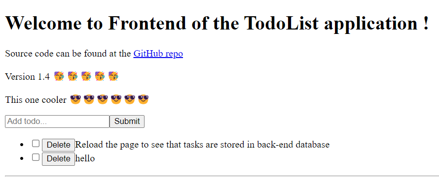

## Exercise 1

**a)**

```{r}
# Load the dataset
ice_cream_dataset <- read.csv("Ice_cream.csv")
data = ice_cream_dataset$video
```


```{r,fig.margin = TRUE,fig.width=6,fig.height=4,fig.align="centerr"}
# Do basic plots
par(mfrow=c(1,2)); hist(data); qqnorm(data); boxplot(data)
```

The histogram of the videogame scores looks normally distributed because it is roughly symetrical around 50, with values getting smaller towards its extremes. Despite this, the histogram bar for values between 60 and 65 is higher than what the corresponding analytical normal distribution should have.

Secondly, the Q-Q Plot also shows that our sample is densely populated in the center and its shape is very close to a line, which is also consistent with normality.

Finally, the boxplot is also consistent with normality, despite its median being not symetrical with its surrounding quantiles. As shown with the histogram, this can be explained with the additional values which are more frequently present in that particular region.

In short, our inspection of these basic plots suggest that this sample is normally distributed.

-----

Because we are assuming by definition that our sample is normally distributed, we can apply the 68-95-99.7% rule. Because our sample has a mean of 51.85 and a standard deviation of 9.9, we can then see that the desired 97% confidence interval for the mean should lie inside the 6 sigma interval, which has a length of 59.9. With this rough estimation, our 97% confidence value for our mean is 51.85 +- 29.7, which is akin to the [22.15,81.55] interval.

To get the 97% CI, we need to evaluate the margin of error with the formula

margin = T(0.97)*(std(x)/sqrt(N))

where T is the t distribution with N-1 degrees of freedom, N our sample size (200)...


```{r}
n <- length(data)
margin <- qt(0.97, df=n-1)*sd(data)/sqrt(n)
min_mean = mean(data) - margin
max_mean = mean(data) + margin
length = max_mean - min_mean
```

Thus, the 97% CI for the mean is [50.52571,53.1749], with a length of 2.648579

-----


### Figures

You can also embed plots, for example:

```{r,echo=FALSE,fig.height=3.5}
plot(cars)
```

Note that the `echo = FALSE` parameter was added to the code chunk to prevent printing of the R code that generated the plot. Use knitr options to style the output of a chunk. Place options in brackets above the chunk.
Other options with the defaults are: the `eval=FALSE` option just displays the R code (and does not run it); `warning=TRUE` whether to display warnings; `tidy=TRUE` wraps long code so it does not run off the page.

You can control the size and placement of figures. For example, 
you can put two figures (or more) next to each other. 
Use `par(mfrow=c(n,m))` to create `n` by `m` plots in one picture in R.
You can adjust the proportions of figures by using the `fig.width` 
and `fig.height` chunk options. These are specified in inches, 
and will be automatically scaled down to fit within the handout margin.
Chunk option `fig.align`  takes values `left`, `right`, or `center` 
(to align figures in the output document).

```{r,fig.margin = TRUE,fig.width=6,fig.height=3,fig.align="center"}
par(mfrow=c(1,2)); x1=rnorm(50); hist(x1); qqnorm(x1)
```

You can arrange for figures to span across the entire page by using 
the `fig.fullwidth` chunk option. 

```{r,fig.fullwidth=TRUE,fig.height=3}
plot(iris$Sepal.Length,iris$Petal.Length,xlab="Sepal.Length",ylab="Petal.Length")
```

More about chunk options can be found at [\color{blue}{\underline{https://yihui.name/knitr/options/}}](https://yihui.name/knitr/options/).


### Equations

To produce mathematical symbols, you can also include \LaTeX\ expessions/equations in your report:
inline $\frac{d}{dx}\left(\int_{0}^{x} f(u)\,du\right)=f(x)$ and 
in the display mode:
\[
\frac{d}{dx}\left( \int_{0}^{x} f(u)\,du\right)=f(x).
\]
To be able to use this functionality, \LaTeX\ has to be installed.
 
### Footnotes

Here is the use of a footnote^[This is a footnote.]. 


### Images
Want an image? This will do it. 
To depict an image (say, `my_image.png` which should be in your current working directory), use this command 



### Tables  

Want a table? This will create one (note that the separators 
*do not* have to be aligned).

Table Header  | Second Header
------------- | -------------
Table Cell    | Cell 2
Cell 3        | Cell 4 


You can also make table by using knit's `kable` function:

```{r echo=FALSE, results='asis'}
library(knitr)
kable(mtcars[1:5,],caption="A knit kable.")
```

### Block quote
> This will create a block quote, 
> if you want one.

### Verbatim
```
This text is displayed verbatim/preformatted.
```

### Links
Links: http://example.com, [in-text link to Google](http://google.com).

This is a \hyperlink{target1}{{\color{blue}{\underline{hyperlink}}}}.

\hypertarget{target1}{{\color{blue}{\underline{This}}}} is where the hyperlink jumps to.

### Itimization, italicized and embolded text
- Single asterisks italicize text *like this*. 
- Double asterisks embolden text **like this**.

One more way to italicize and embold: _italic_ and __bold__.